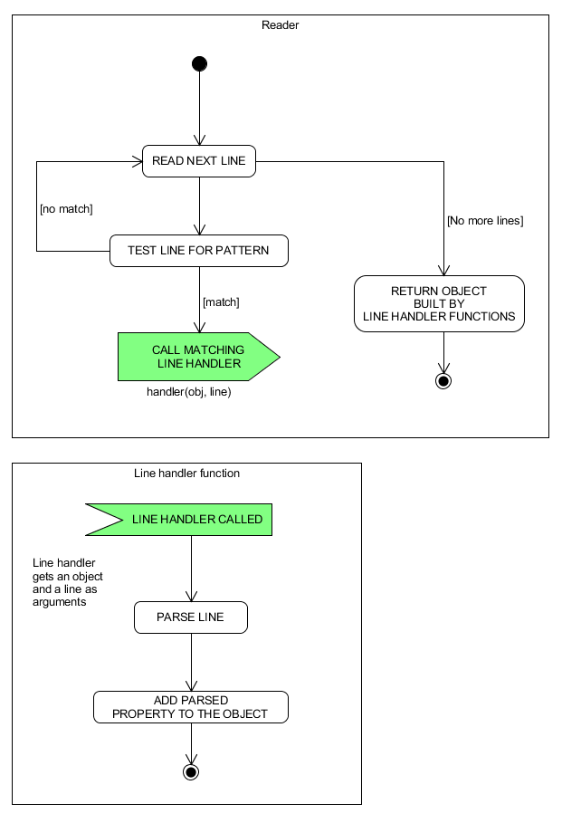

# Package viewer
## [Test in Heroku](https://pkg-viewer.herokuapp.com/)

The project consists of two separate projects: the frontend and the backend. There is a shared top level package.json, but it is there only to enable deployment of two projects under single Heroku app.

**The backend** is a zero dependency Node.js application that reads packages from /var/lib/dpkg/status (or mock data) and exposes them through an API.

**The frontend** is a minimal Vue.js project that consumes the API.

## Testing locally
By default, the backend reads mock data. To read actual Debian/Ubuntu packages, change the filepath under backend/config.js.
```js
cd backend
npm start
```
```js
cd frontend
npm install
npm run dev
```

## How it works
The core of the application is the reader. The packages file is read and parsed for each request. The reader reads the file line by line and tests each line for a pattern (E.g. if the line contains package name or description). If the line matches the pattern, corresponding line handler gets called with the read line passed to it along with the object being built for response.


